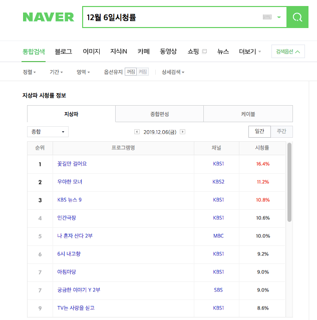
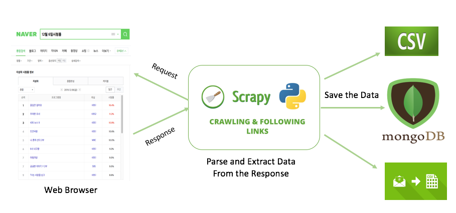
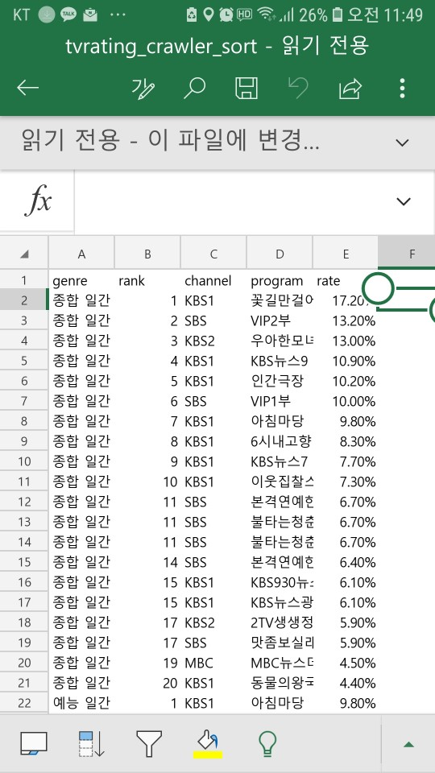
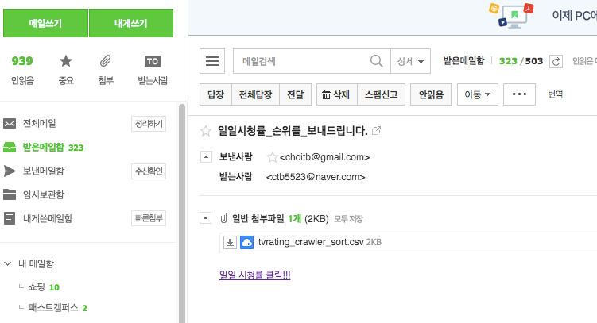

## Crawling TVRatings Webpage using Scrapy in Python

### 1. Overview

#### 1.1 Project purpose

        - Crawling the ratings of TV programs that were popular yesterday and receiving them by e-mail before going to work

#### 1.2  Source of data

        - "https://search.naver.com/search.naver?where=nexearch&sm=tab_etc&query=12%EC%9B%94%206%EC%9D%BC%EC%8B%9C%EC%B2%AD%EB%A5%A0"

#### 1.3  Data Collection and Analysis Methods 

#### 1.4  Scrape data from website

#### 1.5  Required Packages (These packages must be installed)

    1) Scrapy
    2) Pandas
    3) Pymongo

### 2. Progress codes overview 

    1. Creat a scrapy project
    2. Declare items.py
    3. Write Spider.py
    4. Change  settings.py in case forbidden by robots.txt 
    5. Install pymongo for saving the crawling results
    6. Create mongodb module  to connect to the MongoDB
    7. Write Pipelines.py to send items to the mongodb
    8. Add the pipeline to the ITEM_PIPELINES setting in settings.py
    9. Run TVratings_Crawler
    10. Change the format of result using pandas
    11. Sending email with attachments after crawling the website
    
    <Execute Python script via crontab>
    crontab -e
    01 08 * * * /usr/bin/python /home/python3/run_tvratings_crawler.sh >> /home/python3/run_tvratings_crawler.log 2>1
    

### 3. Difficult point

    There was a website that could not be collected by xpath

### 4. future improvement

    Develop code to crawl using lambda functions

####  Thank you ^^
